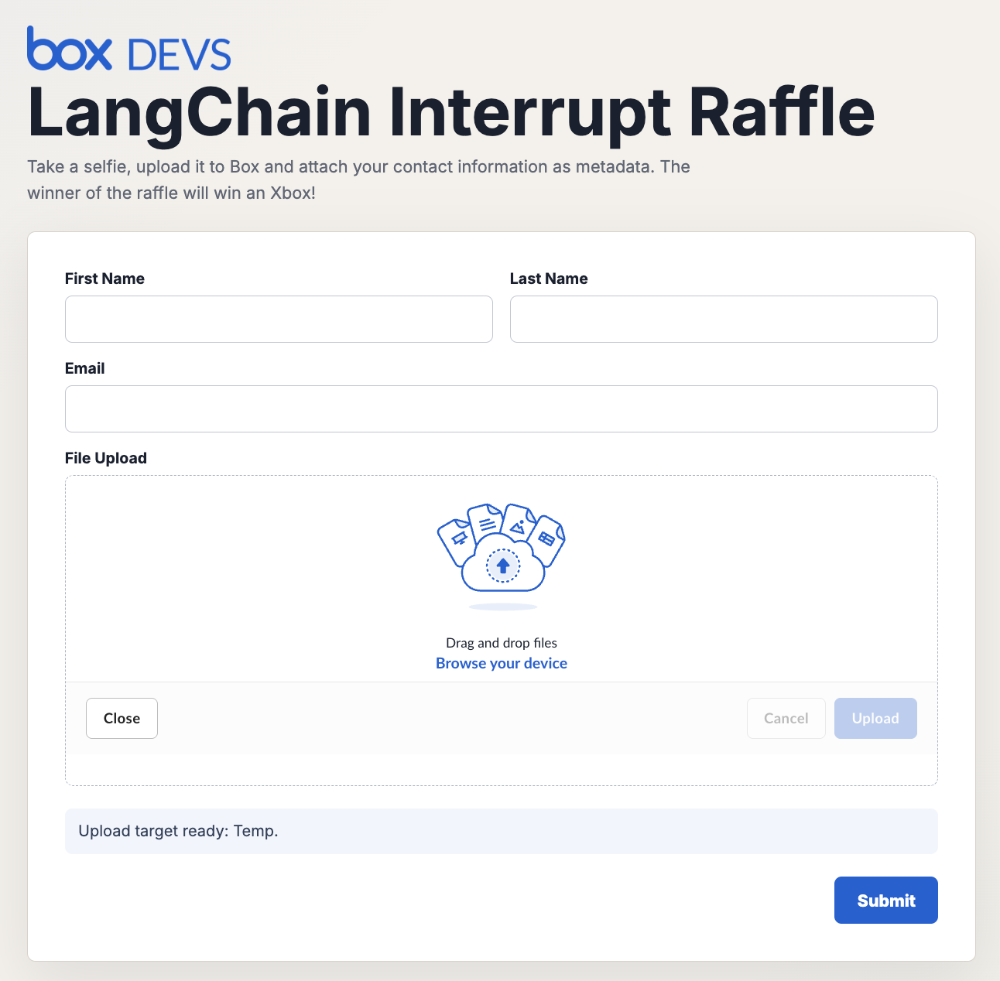

# Box Raffle



A Next.js raffle entry app that uses **Box** as the file store and `box-node-sdk` for all server-side Box API calls.

Entrants fill out a form, upload a file with the Box Content Uploader, and submit. The app uploads directly to a `Raffle` folder with a UUID filename (via a Box `requestInterceptor`), attaches the entrant details as Box metadata, and redirects the entrant to a success page.

Admins can open `/entries` to view files in the raffle folder, preview each file with the Box Content Preview UI element, and pick a winner.

## Prerequisites

- Node.js 20+
- npm
- Box account with access to create or configure an app
  - Sign up: [Free developer account](https://account.box.com/signup/developer)
- A Box app using Client Credentials Grant (recommended) or a short-lived developer token for local testing

## Setup

**1. Install dependencies**

```bash
npm install
```

**2. Create a Box CCG app**

In the [Box Developer Console](https://app.box.com/developers/console), create a Custom App that uses **Server Authentication (Client Credentials Grant)**. Copy the Client ID and Client Secret, then authorize the app in your enterprise Admin Console under Platform Apps Manager.

**3. Configure environment**

```bash
cp .env.example .env.local
```

Then fill in `.env.local` with your Box credentials and folder settings.

**4. Start the app**

```bash
npm run dev
```

**5. Open the raffle form**

```text
http://localhost:3000
```

## Usage

Submit a raffle entry from `/`:

1. Enter first name, last name, and email.
2. Upload one file with the embedded Box Content Uploader.
3. Click Submit.
4. After the Box workflow completes, the app redirects to `/success`.

Review entries from `/entries`:

1. Open `http://localhost:3000/entries`.
2. Click a row to open a modal preview powered by Box Content Preview.
3. Click **Pick Winner** to cycle through entries and select a random winner.

## Architecture

```text
Raffle form (/)
  ↓
Box Content Uploader
  ↓
Raffle folder upload
  ↓
requestInterceptor assigns UUID + original extension
  ↓
/api/box/metadata
  ↓
box-node-sdk
  ├── verify file is in Raffle
  └── apply global/properties metadata
  ↓
Success page (/success)

Entries page (/entries)
  ↓
box-node-sdk lists Raffle folder files + metadata
  ↓
Row click fetches preview token
  ↓
Box Content Preview modal
```

## Box behavior

- `box-node-sdk` is used for all Box API calls from the server.
- The server finds or creates the configured `Raffle` folder under `BOX_PARENT_FOLDER_ID`.
- Browser uploads are scoped to `Raffle`.
- A Box Content Uploader `requestInterceptor` renames each upload to a UUID while preserving the original extension, avoiding filename collisions in the folder.
- On submit, the server validates that the file is in `Raffle` before attaching metadata.
- Entrant metadata is stored on the Box file using the `global/properties` metadata template:
  - `firstName`
  - `lastName`
  - `email`
  - `submittedAt`
- `/entries` only previews files that are currently in the configured `Raffle` folder.

## Environment variables

| Variable | Required | Description |
|----------|----------|-------------|
| `BOX_CLIENT_ID` | Recommended | Box CCG app client ID. Also used for downscoped token exchange in developer-token mode. |
| `BOX_CLIENT_SECRET` | Recommended | Box CCG app client secret. |
| `BOX_ENTERPRISE_ID` | One of | Enterprise ID for CCG service-account access. Use this or `BOX_USER_ID`. |
| `BOX_USER_ID` | One of | Box user ID for CCG user access. Use this or `BOX_ENTERPRISE_ID`. |
| `BOX_ACCESS_TOKEN` | Optional | Short-lived developer token fallback. Useful locally when CCG is not configured. |
| `BOX_PARENT_FOLDER_ID` | Optional | Parent folder where `Raffle` is found or created. Defaults to `0` (All Files root). |
| `BOX_RAFFLE_FOLDER_NAME` | Optional | Raffle folder name. Defaults to `Raffle`. |
| `SECRET` | Required for protected admin routes | Shared secret for `GET /api/box/entries-csv` and `DELETE /api/box/raffle-files`. Send it in the `X-Secret` request header. |

## Routes

| Route | Purpose |
|-------|---------|
| `/` | Entrant form and Box Content Uploader. |
| `/success` | Confirmation page shown after successful submit. |
| `/entries` | Raffle admin table with file previews and winner picker. |
| `/api/box/uploader-config` | Returns the Raffle folder ID and uploader token. |
| `/api/box/metadata` | Finalizes a Raffle upload by tagging it with entrant metadata. |
| `/api/box/preview-token` | Issues a preview token for a file in the Raffle folder. |
| `/api/box/entries-csv` | Downloads a CSV of entrant first name, last name, and email for Raffle folder files. Requires the `X-Secret` header matching `SECRET`. |
| `/api/box/raffle-files` | Deletes all files in the Raffle folder. Requires the `X-Secret` header matching `SECRET`. Returns `{"success": true}`. |

## Production notes

- Prefer Client Credentials Grant for production.
- Use downscoped upload and preview tokens in the browser.
- In the Box app configuration, add your deployed app origin, for example `https://your-raffle.domain.com`, to **CORS Domains**. This is required for the embedded Box UI Elements.
- Lock down `/entries` before using this outside a trusted demo or internal environment.

